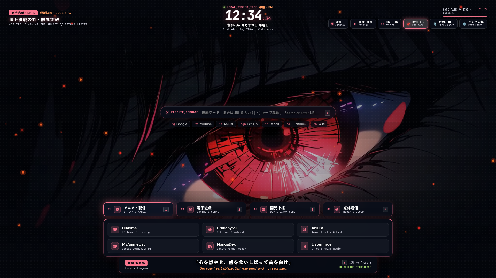
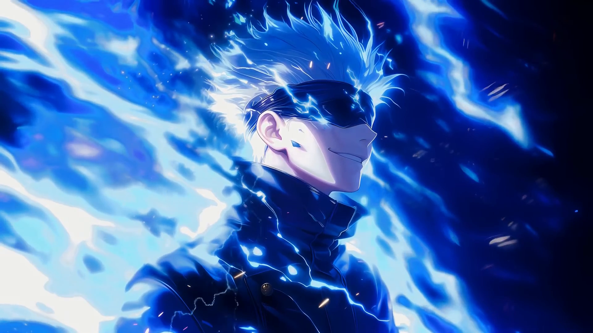
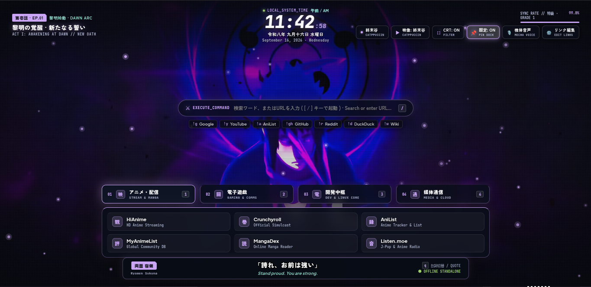
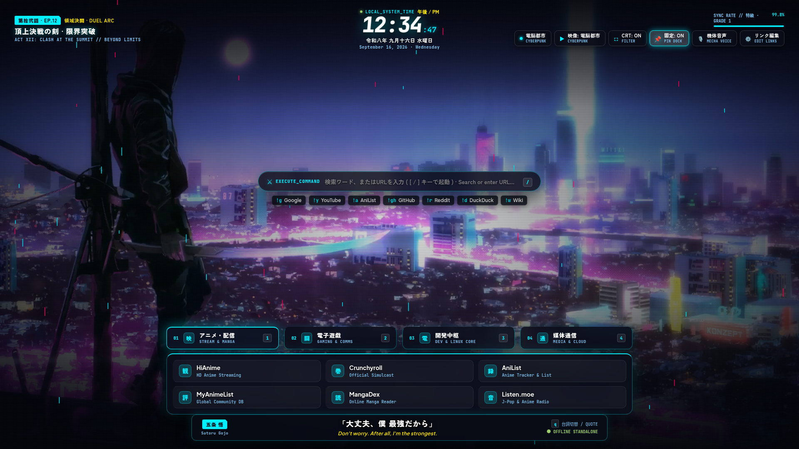

<div align="center">

# ⛩️ 新世界 · SHINSEKAI
### // ANIME CINEMATIC OS · STARTUP PAGE //
**【 領域展開 · DOMAIN EXPANSION FOR YOUR BROWSER 】**

<p align="center">
  <i>Transform every blank new tab into a living anime battlestation.</i><br/>
  <b>Hardware-Accelerated 4K Looping Wallpapers · 60 FPS Atmospheric Particles · Mecha Android Voice · Anime HUD Telemetry</b>
</p>

[](https://github.com/Mimogu/SHINSEKAI-Startup-Page)
[](https://github.com/Mimogu/SHINSEKAI-Startup-Page)
[](https://github.com/Mimogu/SHINSEKAI-Startup-Page)
[](https://github.com/Mimogu/SHINSEKAI-Startup-Page)
[](https://github.com/Mimogu/SHINSEKAI-Startup-Page)

<br />

<p align="center">
  <a href="https://mimogu.github.io/SHINSEKAI-Startup-Page/" target="_blank" rel="noopener noreferrer">
    
  </a>
</p>

<p align="center">
  ⚔️ <b>Instant Web Deployment:</b> <a href="https://mimogu.github.io/SHINSEKAI-Startup-Page/"><b>https://mimogu.github.io/SHINSEKAI-Startup-Page/</b></a><br />
  <sub><em>Experience the live boot sequence, mecha voice greeting, atmospheric particle canvas, and bookmark blades right in your browser!</em></sub>
</p>

<br/>

<p align="center">
  
</p>

</div>

---

> *「心を燃やせ、歯を食いしばって前を向け」*  
> — **煉獄 杏寿郎 (Kyojuro Rengoku)** · *"Set your heart ablaze. Grit your teeth and move forward into the new world."*

---

## ⚡ System Matrix & Features

### 🎬 1. Tri-Category Wallpaper Engine: Live Video, Static Artworks & Custom Library
- **3 Dedicated Modes & Categories**:
  - **動的 (Live)**: Hardware-accelerated looping video backdrops (`crimson.mp4`, `tokyonight.mp4`, `sakura.mp4`, `catppuccin.mp4`, `cyberpunk.mp4`, and Eco mode).
  - **静止画 (Static)**: High-resolution static artworks (`crimson.png`, `tokyonight.png`, `sakura.png`, `catppuccin.png`, `cyberpunk.png`) with minimal RAM (~15MB).
  - **カスタム (Custom)**: User library featuring multi-file uploads and online web URLs with live format badges and individual delete controls.
- **Dynamic File Reading & Multiple Uploads**: Select and upload multiple files at once (`.mp4`, `.webm`, `.png`, `.jpg`, `.webp`, `.gif`). All wallpapers are dynamically read and rendered by actual filename from IndexedDB.
- **Default Deletion & Restoration by Filename**: Delete default live or static scenes from the UI at will. Re-adding/uploading a file with the original name (e.g. `crimson.mp4`, `crimson.png`) or clicking `↺ 初期復元` instantly restores them.
- **Enhanced Online Web URLs**: Add direct links to web images or videos with custom display names, saved directly into your Custom collection.
- **Atmospheric Particle Fusion**: Sakura petals, rising embers, and retro CRT scanlines continue to render dynamically over all wallpapers.

### 🌸 2. Atmospheric Particle Dynamics (60 FPS Canvas)
- Tailored dynamic particle canvas engine reacting to your selected anime faction:
  - **紅蓮 (Crimson)**: Rising flame embers with dual-layer temperature glow.
  - **桜吹雪 (Sakura)**: Fluttering, rotating cherry blossom petals drifting with the wind.
  - **電脳都市 (Cyberpunk)**: Dual-tint neon cyan and hot-pink digital rain streaks.
  - **東京夜 / 終末谷 (TokyoNight / Catppuccin)**: Glowing spiritual energy orbs with cosmic auras.
- **On/Off Toggle Control**: Easily toggle particles on and off with the new **`🌸 粒子: ON/OFF`** button in the top HUD toolbar (Tier 1) or by pressing <kbd>b</kbd>.
- **True Zero CPU/GPU Cost When OFF**: Automatically terminates the `requestAnimationFrame` loop, unloads canvas VRAM, and hides the element.
- **State Persistence & URL Override**: Choice is saved in `localStorage` (`shinsekai-particles`), supports `?particles=off` / `?particles=on` URL params, and is included in profile export/import backups.

### 🎙️ 3. Mecha Android Voice Greeting
- Upon boot sequence completion, an onboard anime android voice announces system readiness:  
  *「ようこそ、ミモグ様。新世界システム、起動完了しました」* (*"Welcome, Mimogu-sama. Shinsekai systems online."*)
- Easily replace with any custom anime voice line or sound effect.

### ⚔️ 4. Anime Episode Header & Chronometer HUD
- **Dynamic Episode Title Card**: Displays episode title, arc tag, and act number that organically shifts based on the time of day (e.g. *第廿四話 · 黎明の咆哮*, *第十二話 · 宵闇の暗躍*).
- **Imperial Japanese Era Clock**: Synchronizes system time with true Japanese kanji era formatting (*令和八年 九月 火曜日*).
- **Combat Power Sync Rate**: Live tactical combat gauge locked at *特級 · SPECIAL GRADE // 99.8%*.

### 💬 5. Subtitle Dialogue System
- Real-time anime dialogue bar rendering legendary quotes in Japanese Kanji/Kana accompanied by English translations.
- Featuring 20 iconic anime lines from **Kyojuro Rengoku**, **Satoru Gojo**, **Ryomen Sukuna**, **Naruto Uzumaki**, **Sasuke Uchiha**, **Mugen** (*Samurai Champloo*), **David Martinez** (*Cyberpunk: Edgerunners*), **Yuta Okkotsu** (*Jujutsu Kaisen*), **Saber** (*Fate/stay night*), **Archer (EMIYA)**, **Kamina** (*Gurren Lagann*), **Tanjiro Kamado**, **Kirei Kotomine**, **Kiritsugu Emiya**, **Lelouch Lamperouge**, **Levi Ackerman**, **Erwin Smith**, **Edward Elric**, **Roronoa Zoro**, and **Monkey D. Luffy**. Click or press <kbd>q</kbd> to cycle anytime.

### 🗡️ 6. Katana Command Console & Hologram Drawer
- Press <kbd>/</kbd> to activate the frosted **Katana Search Console** with direct URL navigation and quick bang queries (`!g`, `!y`, `!a`, `!gh`, `!r`, `!d`, `!w`).
- **Dynamic Holographic Blade Launcher**: Hover over categorized tab blades to deploy bookmarked sectors (*01 Anime*, *02 Gaming*, *03 Dev Core*, *04 Media*).
- **In-Browser Bookmark Editor**: Press <kbd>e</kbd> to customize, add, remove, export, and import bookmarks visually.

### 📺 7. Retro CRT & Film Grain Overlay
- Toggleable scanline filter and analog film grain (<kbd>g</kbd>) for an authentic 90s vintage anime aesthetic.

---

## 🎨 Faction Themes & Screenshots

Switch factions instantly via the header dropdown or by pressing <kbd>t</kbd>:

<div align="center">

<table>
  <tr>
    <td width="50%" align="center">
      <br/>
      <b>🔥 紅蓮 · Crimson Flame</b><br/>
      <sub>煉獄炎獄 · Kyojuro Rengoku Stage (Rising Embers)</sub>
    </td>
    <td width="50%" align="center">
      <br/>
      <b>🌌 東京夜 · TokyoNight Void</b><br/>
      <sub>無量空処 · Satoru Gojo Stage (Spatial Energy Orbs)</sub>
    </td>
  </tr>
  <tr>
    <td width="50%" align="center">
      <br/>
      <b>🌸 桜吹雪 · Sakura Ronin</b><br/>
      <sub>侍道 · Cherry Blossom Stage (Fluttering Sakura Petals)</sub>
    </td>
    <td width="50%" align="center">
      <br/>
      <b>🌀 終末谷 · Catppuccin Spiral</b><br/>
      <sub>螺旋輪廻 · Valley of the End Stage (Chakra Spheres)</sub>
    </td>
  </tr>
  <tr>
    <td colspan="2" align="center">
      <br/>
      <b>⚡ 電脳都市 · Cyberpunk Neon</b><br/>
      <sub>攻殻機動 · Night City Digital Rain Stage (Matrix Rain)</sub>
    </td>
  </tr>
</table>

</div>

<br/>

| Faction Theme | Japanese Lore | Aesthetic Colors | Particle Dynamics | Default Wallpaper |
|:---|:---|:---|:---|:---|
| **紅蓮 · Crimson** | 煉獄炎獄 (Flame Breathing) | Crimson `#f7768e` / Blazing Ember | Rising Flame Embers | `assets/animated/crimson.mp4` |
| **東京夜 · TokyoNight** | 無量空処 (Infinite Void) | Electric Blue `#7aa2f7` / Deep Void | Spatial Energy Orbs | `assets/animated/tokyonight.mp4` |
| **桜吹雪 · Sakura** | 侍道 · 桜散る (Ronin Way) | Cherry Pink `#f4b8e4` / Pastel Mist | Fluttering Sakura Petals | `assets/animated/sakura.mp4` |
| **終末谷 · Catppuccin** | 螺旋輪廻 (Valley of the End) | Lavender `#cba6f7` / Sage Teal | Mystic Chakra Spheres | `assets/animated/catppuccin.mp4` |
| **電脳都市 · Cyberpunk** | 攻殻機動 (Night City Cyber) | Neon Cyan `#00f0ff` / Hot Pink | Vertical Digital Matrix | `assets/animated/cyberpunk.mp4` |
| **カスタム · Custom** | 独自調色 (Pilot Custom Spectrum) | Any HEX color (Live native picker 🎨) | Custom Color Prisms | User-defined or active wallpaper |

---

## 🚀 Deployment & Installation

### Option 1: Native Chromium New Tab (Brave, Chrome, Edge, Opera)

Because this repository contains a valid Manifest V3 `manifest.json`, you can make Shinsekai your official new tab page in seconds without any store extension:

```bash
# 1. Clone the battle station repository
git clone https://github.com/Mimogu/SHINSEKAI-Startup-Page.git
```

1. In your browser, open `chrome://extensions` (or `brave://extensions`, `edge://extensions`).
2. Toggle **Developer mode** **ON** in the top-right corner.
3. Click **Load unpacked** (top-left) and select the cloned `SHINSEKAI-Startup-Page` directory.
4. Press <kbd>Ctrl</kbd> + <kbd>T</kbd>. **Shinsekai is now your operational startpage!**

---

### Option 2: Mozilla Firefox Setup

#### A. Dedicated New Tab
1. Install [New Tab Override](https://addons.mozilla.org/firefox/addon/new-tab-override/).
2. In extension settings, choose **Local File** and point it to `index.html`.

#### B. Homepage / Startup Window
1. Open Firefox **Settings** (`Ctrl + ,`) → **Home**.
2. Under **Homepage and new windows**, select **Custom URLs...**.
3. Enter the absolute path to your local `index.html`:
   - **Linux**: `file:///home/YOUR_USERNAME/Documents/SHINSEKAI-Startup-Page/index.html`
   - **Windows**: `file:///C:/Users/YOUR_USERNAME/Documents/SHINSEKAI-Startup-Page/index.html`

---

## 🎮 Command Keybindings

Navigate your startpage like a mecha cockpit with full keyboard controls:

| Hotkey | Action | Tactical Description |
|:---:|:---|:---|
| <kbd>/</kbd> | **Katana Console** | Instantly focus the search bar from anywhere |
| <kbd>t</kbd> | **Cycle Faction** | Rotate themes (*Crimson → TokyoNight → Sakura → Catppuccin → Cyberpunk → Custom*) |
| <kbd>s</kbd> / <kbd>w</kbd> | **Cycle Scene** | Switch live video stages on the fly |
| <kbd>u</kbd> / <kbd>o</kbd> | **Operator Profile** | Launch the Operator Identity hub to customize pilot name & honorific |
| <kbd>e</kbd> | **Link Matrix** | Launch the visual cyberpunk bookmark configuration dialog |
| <kbd>g</kbd> | **CRT Scanlines** | Toggle vintage anime monitor scanlines and film grain |
| <kbd>b</kbd> / <kbd>a</kbd> | **Particle FX** | Toggle floating particles, cherry blossom petals, or burning flame embers |
| <kbd>c</kbd> | **Clock Format** | Toggle 12-hour (AM/PM) and military 24-hour chrono formats |
| <kbd>p</kbd> | **Lock Drawer** | Pin the holographic bookmark drawer open |
| <kbd>v</kbd> | **Voice Comms** | Re-trigger the mecha android audio greeting |
| <kbd>q</kbd> | **Cycle Dialogue** | Advance to the next anime subtitle quote |
| <kbd>1</kbd> - <kbd>4</kbd> | **Deploy Sector** | Jump directly to bookmark category (*Anime, Gaming, Dev, Media*) |
| <kbd>?</kbd> | **Shortcuts Matrix** | Open the interactive in-cockpit keybindings cheatsheet HUD |
| <kbd>Esc</kbd> | **Cancel / Disengage** | Dismiss search focus, close popovers or exit modals |

---

## 🌐 Tactical URL Query Parameters

Configure or bookmark Shinsekai with pre-configured startup states directly through the URL:

| Query Parameter | Example Value | Description |
|:---|:---|:---|
| `?scene=` | `?scene=tokyonight` | Select background scene (`crimson`, `tokyonight`, `sakura`, `catppuccin`, `cyberpunk`, `eco` or aliases `gojo`, `eyes`, `sasuke`) |
| `?theme=` | `?theme=catppuccin` | Select color faction theme (`crimson`, `tokyonight`, `sakura`, `catppuccin`, `cyberpunk`, `custom`) |
| `?color=` | `?color=%23a6e3a1` | Custom theme hex accent color (e.g. `%2300f0ff` or `ff007f`) |
| `?user=` / `?operator=` | `?user=LEVI` | Override pilot callsign name |
| `?honorific=` / `?title=` | `?honorific=-SENPAI` | Set Japanese honorific (`-SAMA`, `-SAN`, `-SENPAI`, `-KUN`, `none`, or custom) |
| `?particles=` | `?particles=off` | Enable or disable atmospheric particle canvas (`on` or `off`) |
| `?ultra=1` / `?hd=1` | `?ultra=1` | Force startup directly in HD Ultra (1080p) master mode |
| `?pinned=1` | `?pinned=1` | Lock the holographic bookmark drawer open on boot |
| `?noboot=1` | `?noboot=1` | Bypass the 1.5-second cinematic boot sequence for instant page display |
| `?menu=` | `?menu=operator` | Auto-launch a modal on boot (`operator`, `links`, `shortcuts`, `theme`, `scene`) |

*Example Command Link:*  
`index.html?theme=custom&color=%2300f0ff&scene=cyberpunk&ultra=1&user=RENGOKU&honorific=-SAMA&noboot=1`

---

## ⚡ Performance, Memory & Lifecycle Architecture

Shinsekai features an autonomous performance engine engineered to operate at an ultra-low memory footprint (~35–50 MB active, dropping to ~20 MB when inactive):

### 🏎️ 1. Hardware Tier Presets (`high` / `mid` / `eco`)
The engine autonomously detects your hardware environment (`deviceMemory`, `hardwareConcurrency`, screen width, data-saver flags, and `prefers-reduced-motion`) and adapts rendering parameters:

| Tier | Ambient Particles | Backdrop Blur (`--blur-px`) | Film Grain | Video Decoding Stage |
|:---|:---:|:---:|:---:|:---|
| **High** | 30 | `16px` | Enabled | 720p30 Loop (or optional 1080p Ultra) |
| **Mid** *(Default)* | 18 | `8px` | Enabled | 720p30 Loop |
| **Eco** | 0 | `0px` *(flat)* | Disabled | Zero Video Decoding (Static High-Res Backdrop, ~20MB RAM) |

*Manual Override:* Set your preferred tier anytime via DevTools console (`applyTierPreset('eco')`) or let the runtime FPS watchdog manage it dynamically.

### 📼 2. 720p Default with Optional HD Ultra (1080p)
- **720p Default Transcodes**: All 5 anime scene loops are pre-encoded with high-efficiency `libx264`, `preset=slow`, `crf=20`, `scale=1280:720`, `lanczos` filtering, and `+faststart` web optimization, shrinking file sizes by 30–60% with zero perceived quality loss.
- **HD Ultra (1080p) On-Demand**: Surfaced as explicit options in the scene selector (**紅蓮 HD**, **東京夜 HD**, etc.) for large high-DPI displays without imposing memory overhead on normal sessions. The selection automatically persists in `localStorage` across new tabs.

### 💤 3. Deep-Suspend Tab Hibernation
- When you switch away or minimize the tab, all animation loops, clocks, and quotes pause immediately.
- After **20 seconds in the background**, the video stream is completely unloaded from the DOM (`removeAttribute('src')` and `bgVideo.load()`), releasing decoded frame buffers from GPU VRAM and system memory.
- Upon returning to the tab, playback seamlessly resumes from the 720p default stream without delay.

### 🛡️ 4. Dual Watchdogs & Error Recovery
- **Runtime FPS Watchdog**: Continuously measures frame delivery over 2-second windows. If FPS drops below 24 sustained (3 consecutive bad streaks), the engine auto-downgrades the tier to `mid`. If degradation continues, it safely transitions to `eco`.
- **2-Strike Error & Freeze Recovery**: If video decoders stall or throw errors twice consecutively, Shinsekai cleanly falls back to `eco` static mode instead of entering an infinite retry loop.
- **Zero-Latency Boot Loader**: An early inline script parses the URL/stored scene prior to DOM rendering, loading the exact video immediately and eliminating wasteful initial double-decodes.

---

## 🔒 Privacy, Offline & Network Transparency

- **100% Private & Self-Hosted**: Zero trackers, zero telemetry, zero analytics scripts, and zero third-party telemetry beacons. Your bookmarks and pilot profile stay strictly inside your local browser `localStorage`.
- **Network Requests**: External network activity is strictly limited to:
  1. **Google Fonts**: Lightweight typography loading on cold boot (*JetBrains Mono*, *Plus Jakarta Sans*, *Zen Kaku Gothic New*).
  2. **Favicon Cache Sync**: When you add new bookmarks, Shinsekai optionally resolves icons via Google / icon.horse and **stores compact 32×32 data-URIs permanently in localStorage**. Once cached, icons are served 100% offline with zero network requests. Icon syncing is sequentially rate-limited (120ms delays) and completely dormant when offline.

---

## 🔍 Quick Search Bangs

Type any shortcut into the Katana search capsule followed by your query:

| Bang | Target Terminal | Example Command |
|:---:|:---|:---|
| `!g` | Google Search | `!g mechanical keyboard reviews` |
| `!y` | YouTube Video | `!y linux customization guide` |
| `!a` | AniList Database | `!a database search` |
| `!gh` | GitHub Code | `!gh cachyos linux` |
| `!r` | Reddit Community | `!r unixporn` |
| `!d` | DuckDuckGo Privacy | `!d neovim lua setup` |
| `!w` | Wikipedia Archive | `!w artificial intelligence` |

*Tip: Pasting or typing direct URLs (e.g., `github.com`, `mailto:pilot@shinsekai.org`, or `https://archlinux.org`) will jump straight to the destination.*  
*Operator Command Tip: Type `:user <name>` or `:settings` in the search bar to immediately configure your pilot identity.*

---

## 🛠️ Customizing Your Station

### 1. Custom Operator / Pilot Name & Identity
1. Press <kbd>u</kbd> (or click **`👤 OPERATOR`** in the top bar).
2. Enter your desired pilot callsign / name (e.g. `ALEX`, `SHADOW`, `LEVI`, `ZERO`).
3. Select your preferred Japanese honorific protocol (`-SAMA`, `-SAN`, `-SENPAI`, `-KUN`, `NONE / 敬称なし`, or a `CUSTOM` title).
4. Select your **機体性能 (Hardware Performance Tier)** (`HIGH`, `MID`, `ECO`) or click **`🔄 自動判定 (Auto-Detect)`** to benchmark your device based on CPU cores, RAM, and motion preferences.
5. Watch the real-time mecha boot telemetry preview update live as you type.
6. Click **`▶ 起動シミュレーション (Test Boot)`** to immediately experience the cinematic mecha boot sequence and audio greeting with your custom name!
7. *Optional URL Override:* You can also pass `?user=YourName` or `?operator=YourName` directly in the browser address bar.

### 2. Unified Profile & Link Matrix Editor (No Coding Required)
1. Press <kbd>e</kbd> or click the **`⚙️ リンク編集`** button in the header.
2. Select your category blade (**01 アニメ**, **02 電子遊戯**, **03 開発中枢**, **04 媒体通信**).
3. Click **`✏️ 編集`** to modify, **`🗑️ 削除`** to delete, or add bookmarks using the bottom form with custom Japanese kanji seals (`観`, `遊`, `網`, `音`, etc.).
4. Click **`⭳ 設定保存 (Export)`** to download a unified **`shinsekai-profile-<name>.json`** backup containing your complete setup: pinned links, operator name, honorific, active theme, custom theme color, scene, tier, and CRT filters.
5. Click **`⭱ 設定読込 (Import)`** to restore your complete profile anytime on any machine.

### 3. Custom Video Stages
To add or replace video stages, drop your looping `.mp4` into the respective tier folder matching the theme name:
- **Default 720p Loop** (standard playback): Place in `assets/animated/720p/<theme>.mp4`
- **HD Ultra 1080p Loop** (optional high-res mode): Place in `assets/animated/<theme>.mp4`

```
assets/animated/
├── 720p/               # Default 720p30 loops (CRF 20, Lanczos)
│   ├── crimson.mp4
│   ├── tokyonight.mp4
│   ├── sakura.mp4
│   ├── catppuccin.mp4
│   └── cyberpunk.mp4
├── crimson.mp4         # Optional 1080p Ultra master
├── tokyonight.mp4      # Optional 1080p Ultra master
├── sakura.mp4          # Optional 1080p Ultra master
├── catppuccin.mp4      # Optional 1080p Ultra master
└── cyberpunk.mp4       # Optional 1080p Ultra master
```

### 4. Wallpaper Management (Live, Static & Custom)
1. Click the wallpaper button in the top-right tool dock (or press <kbd>w</kbd> / <kbd>s</kbd> to cycle).
2. Choose from the modern segmented control bar:
   - **System Presets Group**:
     - **`▶ 動的 (LIVE)`**: Hardware-accelerated anime video loops displayed by filename.
     - **`🖼 静止画 (STATIC)`**: High-resolution static artworks displayed by filename.
   - **Custom Library Group**:
     - **`📁 カスタム (CUSTOM)`**: Displays a dynamic badge count of your personal collection.
3. **Clean Custom Separation**: Inside the `カスタム` panel, items are strictly organized into dedicated subsections:
   - **`▶ カスタム動的映像 (Custom Videos)`**: Displays uploaded `.mp4` and `.webm` files with exact file size badges.
   - **`🖼 カスタム静止画 (Custom Images)`**: Displays uploaded `.png`, `.jpg`, `.webp`, and `.gif` files with format badges.
   - **`🔗 オンラインリンク (Web URLs)`**: Displays external online image and video bookmarks.
4. **1080p Ultra HD / 720p Toggle Button**: Seamlessly toggle between 720p standard mode (low VRAM, power-efficient) and 1080p Ultra HD mode directly from the wallpaper popover header bar without page reloads.
5. **Multi-File Upload & Storage Limits**: Click **`＋ ファイル追加`** to select and upload multiple files at once (up to 35MB per file). Files are stored safely in **IndexedDB** without 5MB `localStorage` limits.
6. **Contextual Restores & Deletions**:
   - Delete any preset or custom wallpaper at any time via the **`✕`** delete button on each item.
   - Contextual restore banners (**`↺ 削除された初期動画を復元`** and **`↺ 削除された初期静止画を復元`**) appear directly within their respective panels whenever default items are deleted.
   - Uploading a file with the original filename (e.g., `crimson.mp4` or `tokyonight.png`) also automatically restores that preset.

> **Tip for Wayland / Hyprland users:** Shinsekai's companion desktop script also accepts arbitrary static wallpapers:
> ```bash
> ~/.config/hypr/scripts/wallpaper.sh static /path/to/wallpaper.png
> ~/.config/hypr/scripts/wallpaper.sh static crimson   # Uses built-in theme PNG
> ```

### 5. Custom Welcome Voice
Replace `assets/audio/welcome.mp3` with your favorite anime character dialogue or custom voice synthesis clip!

---

## 📁 Battlestation Architecture

```
SHINSEKAI-Startup-Page/
├── assets/
│   ├── animated/           # Theme looping MP4 stages
│   │   ├── 720p/           # 720p30 CRF-20 default web-optimized loops (Faststart)
│   │   │   ├── catppuccin.mp4
│   │   │   ├── crimson.mp4
│   │   │   ├── cyberpunk.mp4
│   │   │   ├── sakura.mp4
│   │   │   └── tokyonight.mp4
│   │   ├── catppuccin.mp4  # HD Ultra 1080p Valley of the End Chakra
│   │   ├── crimson.mp4     # HD Ultra 1080p Flame Breathing Embers
│   │   ├── cyberpunk.mp4   # HD Ultra 1080p Night City Rain
│   │   ├── sakura.mp4      # HD Ultra 1080p Ronin Cherry Blossom
│   │   └── tokyonight.mp4  # HD Ultra 1080p Infinite Void Cosmos
│   ├── audio/              # Mecha female voice welcome asset
│   │   └── welcome.mp3     # 「ようこそ、ミモグ様」
│   └── previews/           # High-resolution theme screenshots
│       ├── catppuccin.png  # 終末谷 Interface
│       ├── crimson.png     # 紅蓮 Interface
│       ├── cyberpunk.png   # 電脳都市 Interface
│       ├── sakura.png      # 桜吹雪 Interface
│       └── tokyonight.png  # 東京夜 Interface
├── index.html              # Clean semantic anime HUD viewport & zero-latency loader
├── links.js                # Default pinned links & kanji seals
├── manifest.json           # Native Chromium Web Extension manifest (V3)
├── README.md               # Mission dossier & documentation
├── script.js               # Reactive engine, tier manager, particle physics & watchdogs
└── style.css               # Glassmorphism, CSS variable blur, GPU isolation & themes
```

---

<div align="center">

### // MISSION COMPLETE //

Crafted with passion for anime culture and clean aesthetics by **[Mimogu](https://github.com/Mimogu)**.  
*Free and open-source for personal startpage customization.*

<br/>

[](https://github.com/Mimogu/SHINSEKAI-Startup-Page)
[](https://github.com/Mimogu/SHINSEKAI-Startup-Page)

</div>
